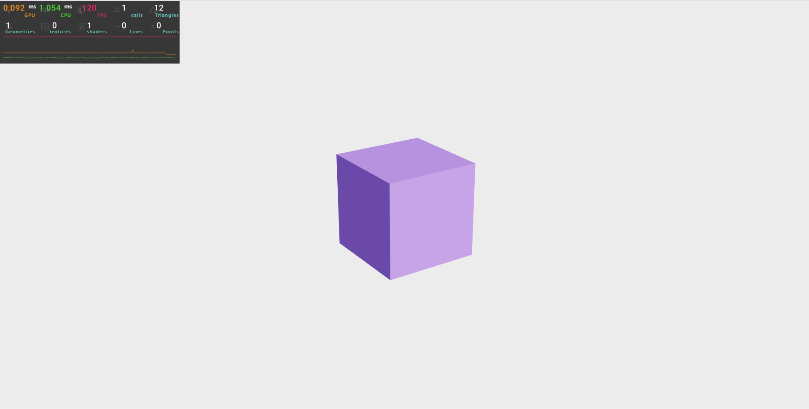

# R3F Boilerplate

Este es mi punto de partida personal para todos los nuevos proyectos WebGL que utilizan el ecosistema de React Three Fiber. Está configurado con Vite para una experiencia de desarrollo rápida y moderna.

### Características Incluidas

-   **Framework:** React 18
-   **Empaquetador:** Vite
-   **Motor 3D:** Three.js
-   **Renderizador:** React Three Fiber (`@react-three/fiber`)
-   **Utilidades:** Drei (`@react-three/drei`)
-   **Monitor de Rendimiento:** `r3f-perf`

### Dependencias Principales

| Paquete                 | Versión   |
| ----------------------- | --------- |
| `react`                 | `^18.3.1` |
| `three`                 | `^0.164.1`|
| `@react-three/fiber`    | `^8.16.6` |
| `@react-three/drei`     | `^9.105.6`|
| `r3f-perf`              | `^7.2.1`  |

### Cómo Empezar

1.  Clona o descarga este repositorio.

2.  Instala las dependencias:
    ```bash
    npm install
    ```
3.  Ejecuta el servidor de desarrollo:
    ```bash
    npm run dev
    ```


<div align="center">



</div>